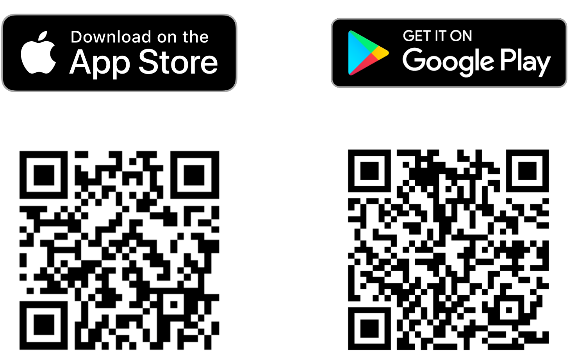

# Desenvolvimento de Aplicativos Móveis com SAP Build Apps, Acessando-os via SAP Mobile Start

## Descrição

Este repositório contém o material para o desenvolvimento de Aplicativos Móveis com SAP Build Apps, acessando via SAP Mobile Start.

<!--  -->

## Visão Geral

O aplicativo SAP Mobile Start é seu ponto de entrada nativo para o universo móvel da SAP. Descubra como configurar e configurar o SAP Mobile Start com o SAP S/4HANA e como adicionar seus aplicativos nativos. Você entenderá todos os pré-requisitos e etapas necessárias.

## Requisitos

Os requisitos para seguir os exercícios neste repositório são:

- Global Account SAP BTP
- Sub account SAP BTP
  - Ambiente Cloud Foundry habilitado
  - Entitlement *SAP Build Work Zone, standard edition*
  - Entitlement *SAP Build Apps*
  - Cloud Foundry Runtime
  - Destination Service
  - Identity Authentication Service Tenant
- Acesso de administrador para esta Sub account
- (Opcional) Um sistema S/4HANA
  - Content Exposure do SAP S/4HANA para SAP Build Work Zone, standard edition
  - [S/4HANA Cloud Edition](https://help.sap.com/docs/CIAS%20LPD%20for%20S_4%20Cloud/b4ae4453db454f1d8775a4f69826453f/069f16288f394305a7be38a480384807.html?locale=en-US)
  - [S/4HANA On Premise](https://help.sap.com/docs/CIAS%20FES%202020/ecb81b5bfce440ca8e7e7c9ad58fcf3a/98a3f0830f084aefb5ea75fb20959af5.html?locale=en-US)
  - Funções atribuídas ao usuário no SAP S/4HANA correspondentes ao conteúdo exposto
- Um telefone celular (iOS ou Android) capaz de executar o SAP Mobile Start

## Exercícios

> **NOTA:** Para a Sessão Prática, já preparamos o landscape com **SAP Build Work Zone, edição padrão** e **SAP Build Apps**. Por favor, comece diretamente com o Exercício 1 como participante presencial.

- [Exercício 0 - Pré-requisitos e Configuração do landscape](exercises/ex0/)
- [Exercício 1 - Crie seu primeiro aplicativo com SAP Build Apps](exercises/ex1/)
- [Exercício 2 - Adicione mais detalhes e capacidades nativas ao seu aplicativo](exercises/ex2/)
- [Exercício 3 - Construa seu Aplicativo](exercises/ex3/)
- [Exercício 4 - Integre seu aplicativo com SAP Build Work Zone, edição padrão e adicione-o ao SAP Mobile Start](exercises/ex4/)

## Acesso ao Sistema

- [SAP Build Apps](https://xp161-dt162-x75hy9xc.eu10.build.cloud.sap/lobby)
- [SAP Build Work Zone, edição padrão](https://xp161-dt162-x75hy9xc.dt.launchpad.cfapps.eu10.hana.ondemand.com/)

## Recursos Adicionais

- [SAP Mobile Start (Comunidade SAP)](https://community.sap.com/topics/mobile-experience/start)
- SAP S/4HANA - Guia de Exposição de Conteúdo e Integração
  - [Edição na Nuvem do S/4HANA](https://help.sap.com/docs/CIAS%20LPD%20for%20S_4%20Cloud/b4ae4453db454f1d8775a4f69826453f/069f16288f394305a7be38a480384807.html?locale=en-US)
  - [On Premise do S/4HANA](https://help.sap.com/docs/CIAS%20FES%202020/ecb81b5bfce440ca8e7e7c9ad58fcf3a/98a3f0830f084aefb5ea75fb20959af5.html?locale=en-US)
- [Provisionamento de Identidade (Documentação)](https://help.sap.com/docs/Launchpad_Service/8c8e1958338140699bd4811b37b82ece/1c231333f1d24ae0a8e60ce688c4f692.html)
- [SAP Build - low-code & no-code (Comunidade SAP)](https://community.sap.com/topics/low-code-no-code)
- [SAP Build Work Zone, standard edition (Comunidade SAP)](https://community.sap.com/topics/work-zone/standard)

## Baixar SAP Mobile Start

Você pode baixar o SAP Mobile Start para iOS e Android nas respectivas App Stores.

## Como obter suporte

O suporte para o conteúdo deste repositório está disponível durante o tempo real da sessão para a qual este conteúdo foi projetado. 

- [Documentação para SAP Mobile Start no SAP Help](https://help.sap.com/docs/SAP_MOBILE_START?locale=en-US)
