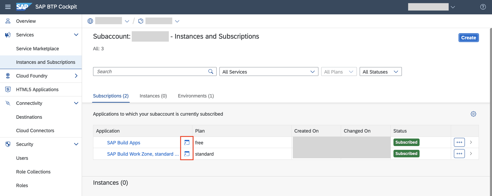

# Prerequisites & Landscape Setup

> **NOTE:** The steps of this exercise was already executed for your user for the SAP TechEd 2023 Hands-on Session. Please continue with Exercise 1 as an in-person participant. You can refer to this exercise if you are doing the Hands-on Workshop outside of SAP TechEd 2023.

## Prerequisites

- SAP BTP Global Account
- SAP BTP Subaccount
  - Cloud Foundry Environment enabled
  - *SAP Build Work Zone, standard edition* entitlement
  - *SAP Build Apps* entitlement
  - Cloud Foundry runtime
  - Destination Service
  - Identity Authentication Service Tenant
- Admin access for Global Account (Running the booster)
- Admin access for this Subaccount
- (Optional) An S/4HANA System

## Step 1: Establish Trust to your Identity Authentication Service

1. Go to your Subaccount on SAP BTP and navigate to **Trust Configuration** under **Security**

    

2. Click on the button **Establish Trust**
3. Select your Identity Authentication Tenant from the dropdown
4. Click **Establish Trust**

    

## Step 2: Run the booster for SAP Build Apps

1. At the SAP BTP Cockpit select your global account
2. Select **Boosters** and search for `SAP Build Apps`.

    

3. Press **Start**
4. In **Get started with SAP Build Apps** press **Start**
5. Check the Prerequisites to be met and press **Next**
6. Under **Select Scenario** choose **Select Subaccount**

    

7. We recommend choosing the **standard** service plan for this exercise. For testing only purposes the **free** plan may be sufficient as well
8. Choose your subaccount and space to continue

    

9. Select your **Identity Authentication** tenant for at least the dropdown **Custom Identity Provider for Applications** and optional as well for **Platform Users**

8. Add the emails of the desired administrators and developers in the dedicated fields

    

8. Review your settings and click finish

    

## Step 3: Assign roles for SAP Build Work Zone, standard edition 

1. Navigate to your subaccount in **SAP BTP Cockpit**
2. Navigate to **Role Collections** under **Security**

    

3. In the role collection list, find **Launchpad Admin** and choose it to open
4. Choose the **Edit** button and scroll down to **User** section. Enter your e-mail address in the section and select **Custom Identity Provider** as **Identity Provider**. Repeat the step for all the users who need admin access.
5. **Save** your changes

    

## (Optional) Step 4: Configure S/4HANA

In order to see more business content in **SAP Mobile Start**, you can also configure your **SAP S/4HANA** system to expose business content to **SAP Build Work Zone, standard edition**. With that the content will also be visible in **SAP Mobile Start**.

Check out the Hands-on session [DT162](https://github.com/SAP-samples/teched2023-DT162) to learn more about this.

## Congrats

Awesome! You completed Exercise 0 for the prerequisites. 🥳

Now you should be able to see both **SAP Build Apps** as well as **SAP Build Work Zone, standard edition** in your BTP subaccount under **Instances and Subscriptions**. Using the small window icon you can access the application in order to work with these.

You can now navigate to the [Overview](../../#exercises).  
If your instructor already told you to continue with [Exercise 1](../ex1/), you navigate there using [this link](../ex1/).

## Troubleshooting

### SAP Build Apps with a SAML Identity Provider

SAP Build Apps requires an SAP Identity Authentication Service tenant connected via OpenID Connect (OIDC) to the SAP BTP subaccount using the **Establish Trust** functionality.

### IAS tenant not appearing under Establish Trust

The SAP Identitiy Authentication Service Tenant only appears under **Establish Trust** when both is assigned to the same customer id.

See [SAP Help](https://help.sap.com/docs/btp/sap-business-technology-platform/establishing-trust-automatically?version=Cloud&locale=en-US) for more information
