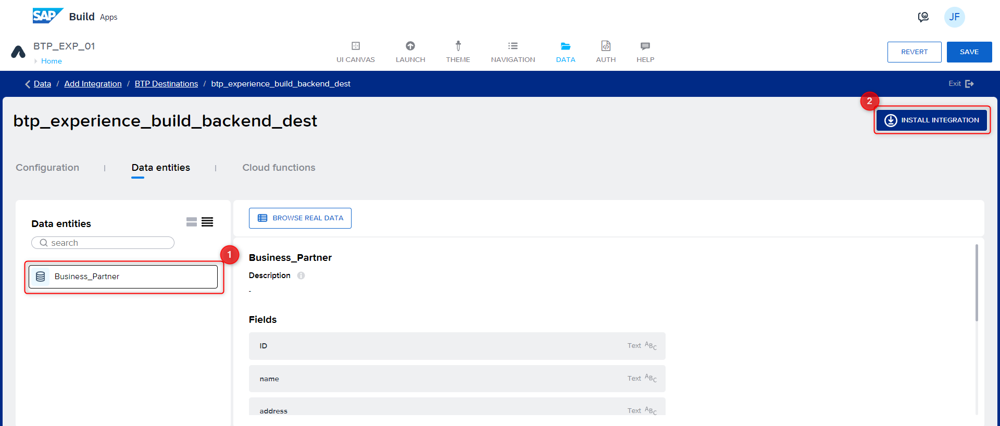
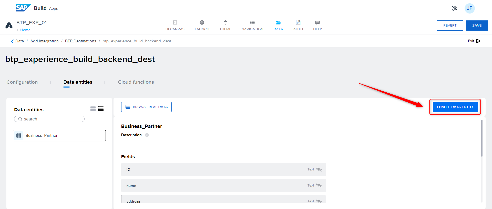

# Create your first application with SAP Build Apps

## Introduction

In this section you will create a new Application using SAP Build Apps.

## Prerequisites

- You have completed previous exercise and completed the setup steps (This is already setup for you today)

## Step 1: Launch SAP Build Apps

Open [SAP Build Apps](https://xp161-dt162-x75hy9xc.eu10.build.cloud.sap/lobby). Outside of SAP TechEd 2023 you can open it via the **SAP BTP Cockpit** as described below.

1. Open your **SAP BTP subaccount**.

2. From the left-side of your subaccount menu, navigate from **Services → Instances and Subscriptions**.

3. In the tab **Subscriptions**, find **SAP Build Apps** and choose **Go to Application** to open the entry page for Application Development.

    

4. Log in to the Application using your Identity Provider credentials.

## Step 2: Create an Application using SAP Build Apps

**Create a Project**

1. On the SAP Build Lobby, choose to **Create** and choose **Build an Application**.

    

2. Choose **Web & Mobile Application**.

    

3. Enter a Project Name, In the format ``XP161_##`` where **##** is your group number, e.g. `XP161_00`

4. Enter a **Short Description**.

5. Choose **Create**.

    

6. Your created project will be opened in **App Builder** which is the central page to build your application including a user interface, logic, as well as data integration.

7. Choose **Headline**.

8. Find the **Properties** tab in the menu on the right to change the content of the title. Choose **Content** and change the content from **Headline** to **Business Partners**.

    

9. Find the text field in the UI canvas in the center of your screen and choose **x** to remove this component.

    

10. Choose the blank page. On the right side under the **Properties**, choose **Page name**.

11. Change the page name to **Home**.

    

## Step 3: Enable Authentication

To consume data from your SAP backend system or mock data that is configured as a SAP BTP destination in the previous section, you need to enable authentication.

1. Choose **AUTH** at the top section of the app builder.

2. Choose **Enable Authentication**.

    

3. Select **SAP BTP Authentication** and choose **OK**. This enables authentication for the project.

    

## Step 4: Add a data Source

To add a data source, you need to add the following steps to your project.

1. Choose the tab **Data** at the top of App builder.

2. Find section **No systems integrated** and choose **Add Integration**.

    

3. On the next screen **SAP Systems**, select **BTP Destinations**.

4. Select the destination that is already created for this exercise - `BusinessPartners`.

5. Click **Install Integration**.
   
6. Under the **Data entities**, select **A_BusinessPartner**.

    

7. Select **Enable Data Entity** to enable it.
   
8. Now, search for **A_BusinessPartnerAddress** and choose **Enable Data Entity**.

9.  Repeat the same for **A_AddressPhoneNumber**.

10.  Choose **Save** at top of the app builder. This adds the data source to your project. Choose **UI Canvas** to go back to the UI designer view.

11. Now you have added a data source for your SAP Build Apps application.

## Step 5: Create a Business Partner List Page

To create the page displaying the list of business partners, you need to first create **data variables**.

**Data Variable**

A data variable is essentially the same as a page variable that exists in the context of the current page that is not accessible from other pages, and disappears if the page is removed from the navigation stack. The difference is that it gets its schema from the data resource it points to, and it comes with included default logic.

**Creating a Data Variable**

Let us create a data variable to store the results of the business partner data coming from the data source.

1. From the UI canvas, choose the toggle button to switch from **VIEW** to **VARIABLES**.

2. Choose **DATA VARIABLES** on the left side of app builder.

3. Now, choose **ADD DATA VARIABLE** and select **A_BusinessPartner**.

    

4. Change the **Data variable name** to `A_BusinessPartner`

   

5. Choose **SAVE**.

Now that the data variable is created, toggle back to the **VIEW** mode.

**Creating a Business Partner List**

At this step, you are creating a Business Partner List page in app builder.

**Check That the Data Is Visible in the UI**

1. On the left panel of UI CANVAS, you see the **CORE** tab, scroll to the **LISTS section** and choose **List item**.

    

2. Drag the **List item** to the application's page.

3. On the right side **PROPERTIES** section, scroll to **Repeat with** and select it.

    

4. A popup opens. Select **Data and Variables**, then choose **Data variable**.

    

5. Select **A_BusinessPartner** from the list and choose **SAVE**.

You have now configured that the list gets populated with the data variable which gets business partner data from the backend system.

**Select the display fields for the List**

Let us now define what fields we would like to show in the UI in the business partners list.

1. Choose the list.

2. Go to **PROPERTIES**.

3. Choose Primary Label **ABC**.

    

4. Choose **Data item in repeat**.

5. Choose **current**.

6. Select **BusinessPartnerFullName**

7. Enter `Name` in the field for **Set preview value** and choose **SAVE**.

    

8. Go to **PROPERTIES**.

9. Choose Secondary Label **ABC**.

10. Choose the **Data item in repeat**.

11. Choose **current**.

12. Select **BusinessPartner**.

13. Enter `Id` in the field for **Set preview value** and choose **SAVE**.

    

14. Choose **SAVE** to save the changes in the application.

## Step 6: Preview the Application

1. Choose the **LAUNCH** tab.

2. Choose **OPEN PREVIEW PORTAL**.

3. A new tab opens. Select the application you have created with your number.

4. The application is launched in the preview portal.

    

The application's first page is now displayed.

## Congrats

Awesome! You completed Exercise 1. 🥳

You can now navigate to the [Overview](../../#exercises).  
If your instructor already told you to continue with [Exercise 2](../ex2/), you navigate there using [this link](../ex2/).
