# Add further details and native capabilities to your application

## Introduction

In this section you will now create a page to show the details of the selected business partner for your Application

## Prerequisites:

- You have completed previous exercises
- Your SAP Build App is working and List Page loads

## Step 1: Create a New Page

You will add a new page to your application and add page parameters so you can access data from your application.

1. On the top left section, choose the name of your current page **Home**, which is highlighted in light blue to open the page menu of SAP Build Apps.

2. Choose **ADD NEW PAGE**.

    

3. Enter `Details` as **Page name**, and then Select **OK**. Your new page will be created and open.

4. On the Details page, choose the toggle button at the top left to switch to **VARIABLES** view.

5. Choose the **PAGE PARAMETERS** button on the left side of the screen.

6. Choose **ADD PARAMETER**.

    
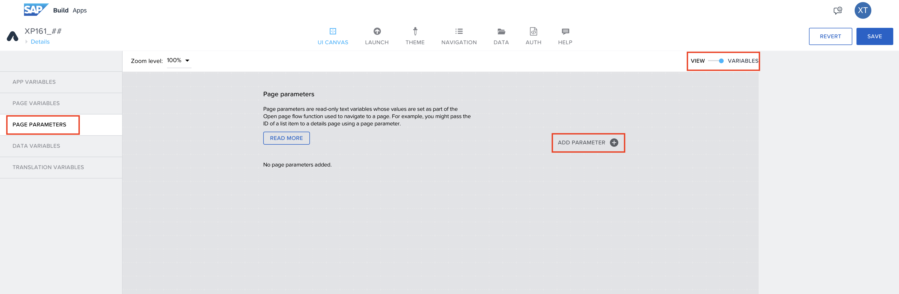

7. It creates a new parameter, choose the created parameter to edit.

8. On the right side of the screen, change the **Parameter name** to `businessPartnerId`.

9. Again, choose **ADD PARAMETER** and create a second parameter.

10. Change **Parameter name** to `businessPartnerName`.

11. Choose **SAVE**.

    
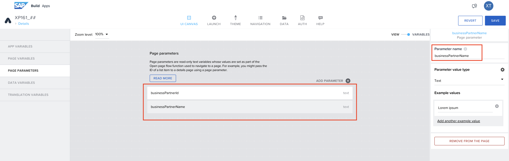

## Step 2: Enable Navigation from Home Page to Details Page

To show the business partner details on the details page, you need to connect the **Home** page and the **Details** page. In this section, you will first create a new navigation logic to pass the page parameter created in the previous step. On the details page, you will then load the business partner address by passing the business partner id to the **A_BusinessPartnerAddress** entity.

1. On the top left section, choose the name of your current page **Details**, which is highlighted in light blue, to open the **PAGES** menu.

2. Select **Home** to switch to Home page to create a logic to pass the business partner and business partner full name parameters from Home page to Details page.

3. Switch the View Mode at the top right from **Variables** to  **View**. Select the first row in the list.

4. At the bottom of App Builder where you can see **Add logic to LIST ITEM1**. Choose the arrow to open the logic canvas.

    

5. In the component menu on the left side, choose **NAVIGATION → Open page** to add a function that opens a new page.

6. Drag and drop it to the Logic canvas.

7. Hover over the **Component tap** and choose the round dot. Connect the dots of the **Component tap** and the **Open page** components. It creates a new connection and sets the logic to open a new page on the event of tapping an item in the list item.

    
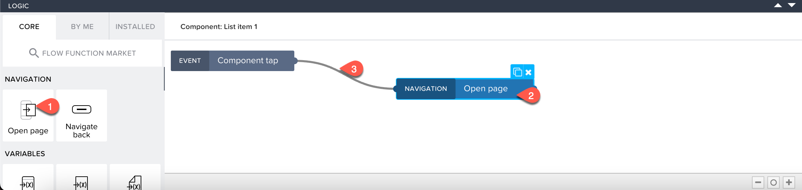

8. Choose the **Open page** component.

9. On the right side of the screen, select **PROPERTIES → Parameters → businessPartnerId**.

10. Choose the **X** button. It opens a popup.

    
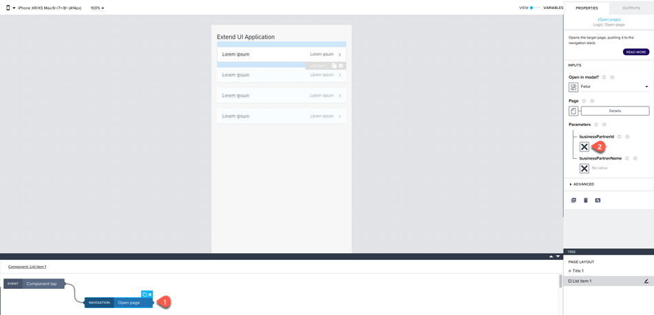

11. Select **Data item in repeat**.

12. Select **current**.

13. Scroll the list and select **BusinessPartner**, and then choose **SAVE**.

    
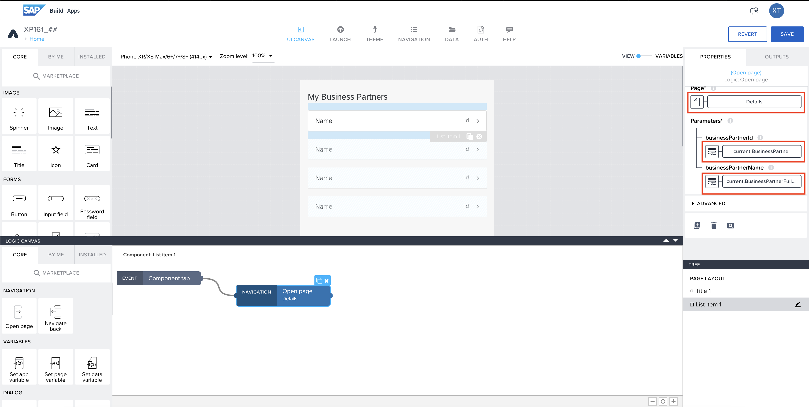

14. Repeat the same for to the **businesspartnerName** parameter and select **current.BusinessPartnerFullName**.

15. Choose **SAVE** to save the changes.

With this step now, you can pass the selected business partner id and name fields from the list to the details page.

## Step 3: Load Business Partner Address on the Details Page

The detail page receives the Business partner ID from the main page. In this step, the ID is used to get the address of the selected business partner.

1. From the left side of the screen, choose **Home**.

2. Select the **Details** page from there to switch to the Details page.

3. Toggle to the **VARIABLES** tab.

4. Select **DATA VARIABLES** on the left.

5. Choose **ADD DATA VARIABLE**.

6. Select **A_BusinessPartnerAddress** from the list.

    

7. Set its **Data variable name** to `A_BusinessPartnerAddress`

8. Choose the **Filter Conditions** button on the right.

9. A popup opens. Select **Object with properties**.

    
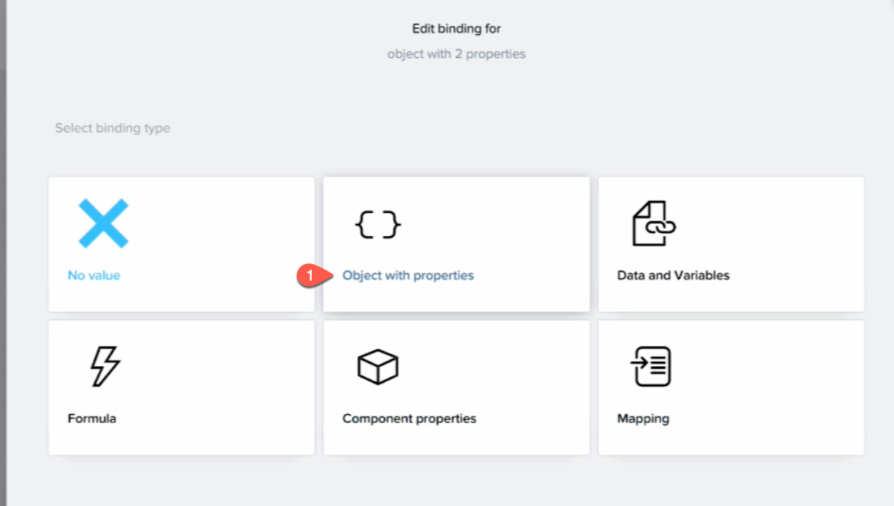

9. Choose **Add Condition**. In the **Property** dropdown, select **Business Partner**.

10. Under **Compared Value**, choose button **ABC**.

    

11. Select **Data and Variables**.

    
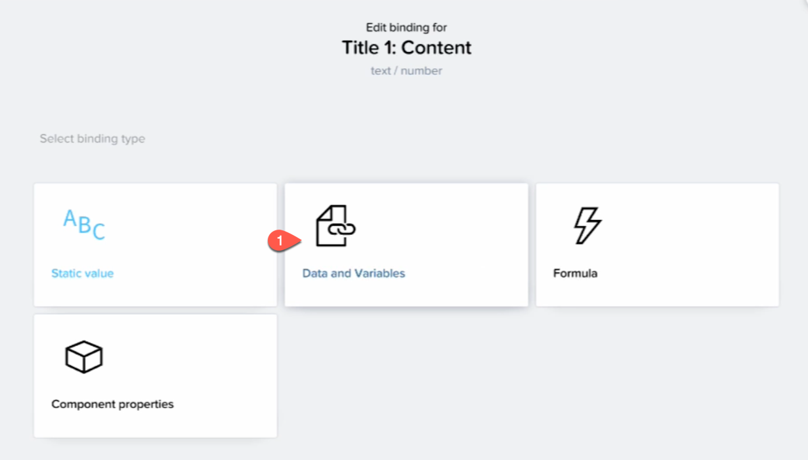

12. Select **Page parameter**.

    
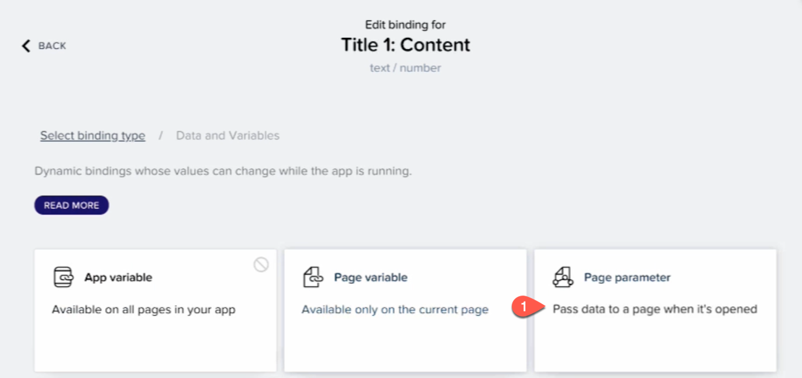

13. Select **businessPartnerId** and choose **SAVE**.

    
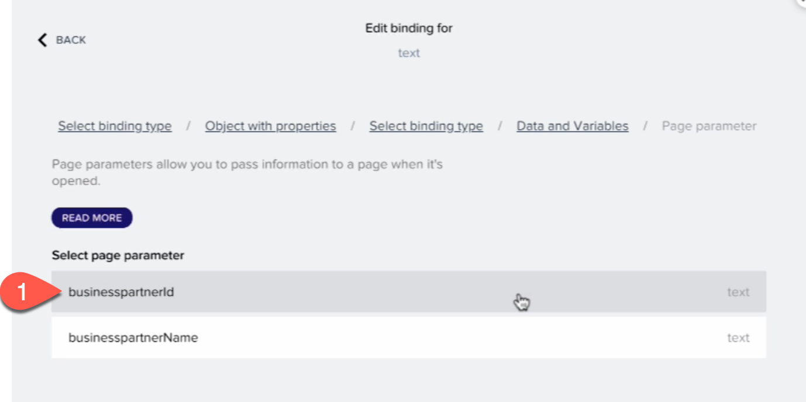

14. Choose the **SAVE** button to save changes to the page.

15. Toggle to the **VIEW** mode now.

Now, your application loads the business partner's address and stores it to the data variable.

## Step 4: Display the Business Partner Name on the Details Page

Next, you will change the header of the details page, so it displays the current Business Partner.

1. Select the default description on the page and delete it by pressing **X**.

    

2. Select headline component. On the right side of the screen, choose **ABC** button in **Content** section.

    

3. Select **Data and Variables**.

    

4. Select **Page parameter**.

    

5. Select **businessPartnerName** and enter `Name` as **Set preview value**.

6. Choose **SAVE**.

    

## Step 5: Display Business Partner Addresses on the Details Page

As a business partner can have multiple addresses, we need a repeated section for each address.

1. Drag a **Container** from the **CORE** tab on the left into the canvas.

2. From the right **PROPERTIES** panel, choose the **Repeat with** button.

    

3. In the popup, select **Data and Variables → Data variable**.

    

4. Select **A_BusinessPartnerAddress** from the list.

5. Choose **SAVE**.

    

6. Drag now a **Row** UI Element into the previously created Container.

    
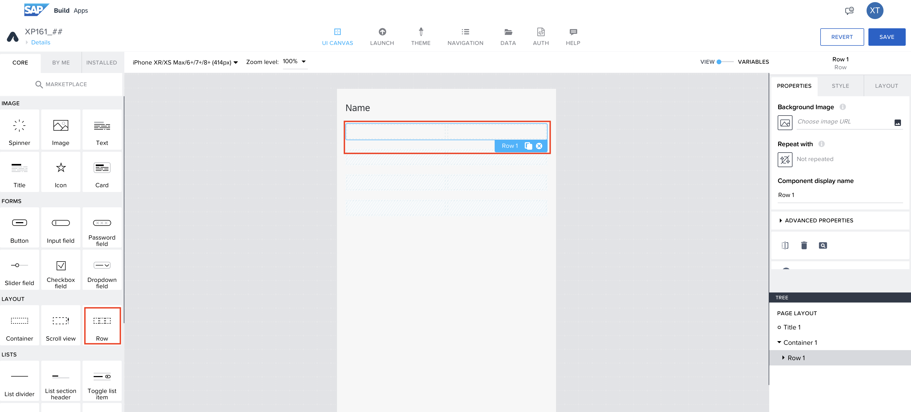

7. Drag now a **Text** into the left side of the **Row**

8. On the right side of the screen, choose **ABC** button under **Content**.

    
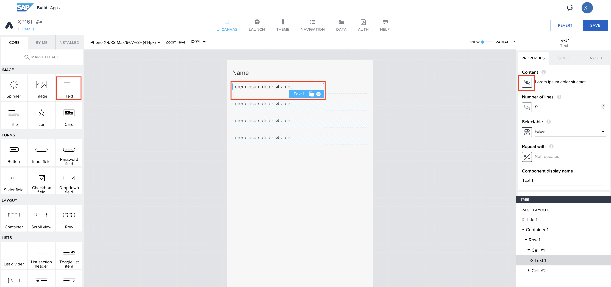

9. Select **Formula** and enter `current.StreetName`.

    

10. Choose **SAVE**.

11. Add another Text to the right **Cell** of the Row using the Formula `current.HouseNumber` as **Content**.

12. Add another row below in the **Container** and add again a **Text** to each of the two cells.

    
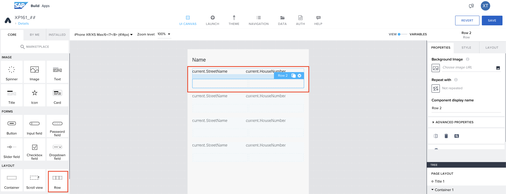

13. Use here the Formulas `current.PostalCode` and `current.CityName` respectively. Choose **SAVE**.

    
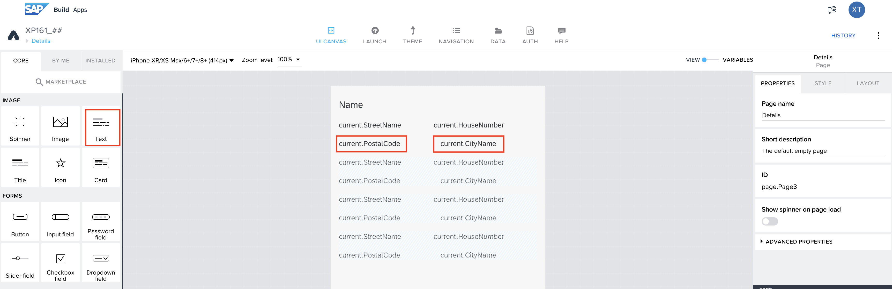

14. Choose **SAVE** at the top of page.

## Step 6: Preview Your Application

1. Choose the **LAUNCH** tab.

2. Choose **OPEN PREVIEW PORTAL** and choose **Open web preview** button.

3. Select your application and choose **OPEN**.

    

4. Choose any entry in the list item to see the details page.

The main page should look like:

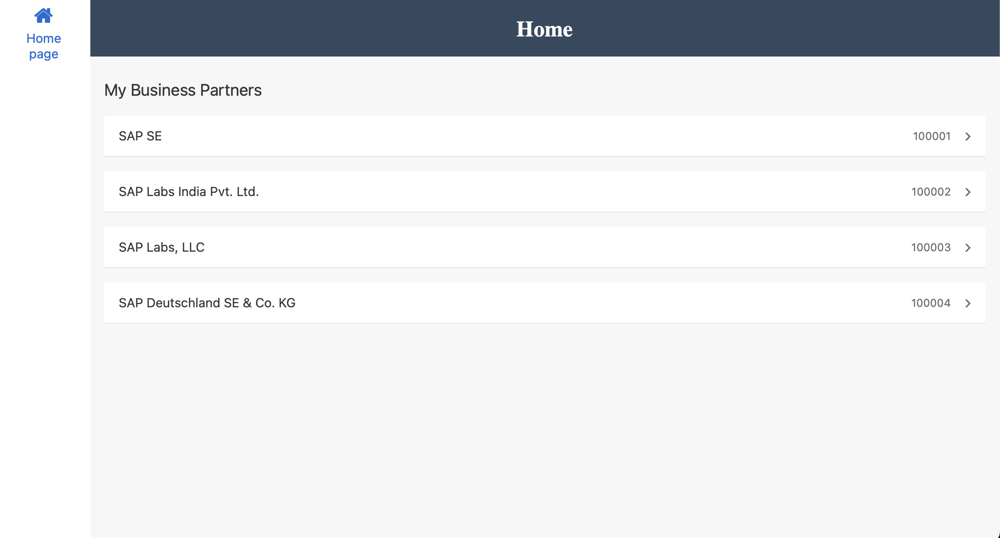

The details page should look like:

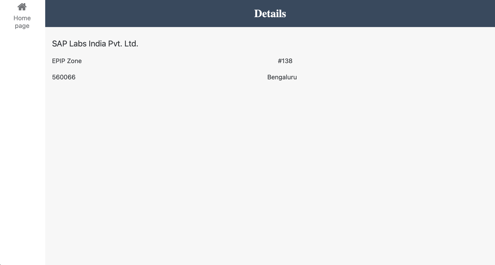

## Step 7: Adding Phone Number and Call Option

1. In the Details **Page**, change view to **VARIABLES**.

2. Click on **DATA VARIABLES**.

3. Click on the plus and add **A_AddressPhoneNumber**

    

4. Remember to change its **Data variable name** to `A_AddressPhoneNumber`.

5. Click on **SAVE** button.

6. Switch back to **VIEW** mode and ensure you are on the **Details** page.

7. Drag a **Button** element into the **Container**.

    
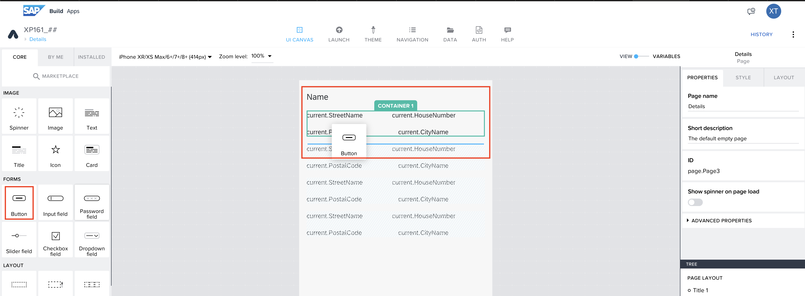

8.  Click on newly added **Button** and then click on the **ABC** under **Label**.

    
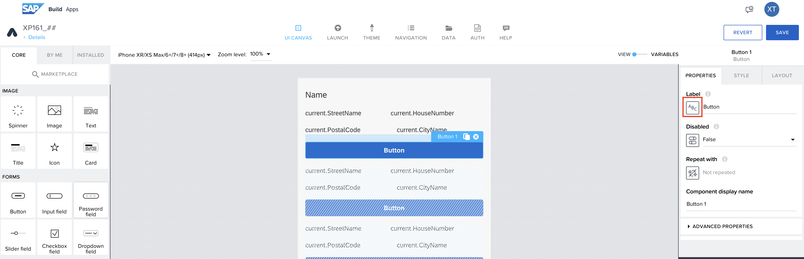

9. Add the following Formula: `"Call "+FIND(data.A_AddressPhoneNumber, item.AddressID == current.AddressID).InternationalPhoneNumber`.

    
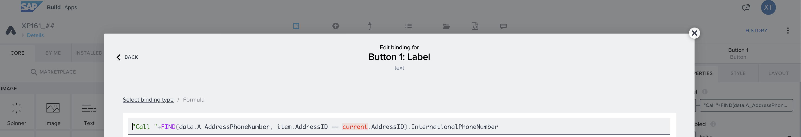

    > Explanation: As the AddressPhoneNumber is a separate entity, we select the phone number entry that belongs to the current address. This is achieved with the **FIND** function, that takes a list as the first parameter and the selection criteria as the second. We leverage the entity relationship with the matching **AddressID** key.

10. Make sure the button is still selected and then choose **Add logic to BUTTON1** at the bottom right.

    
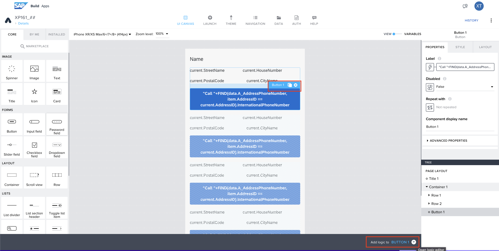

11. Click on **Installed** and check if **Open URL** appears in the list. If so, you can continue with step 15 below.

    
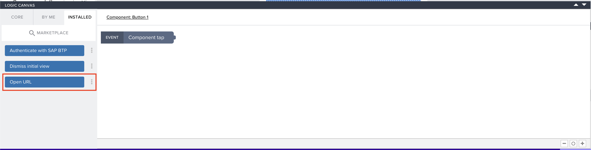

12. Click on **MARKETPLACE**.

    
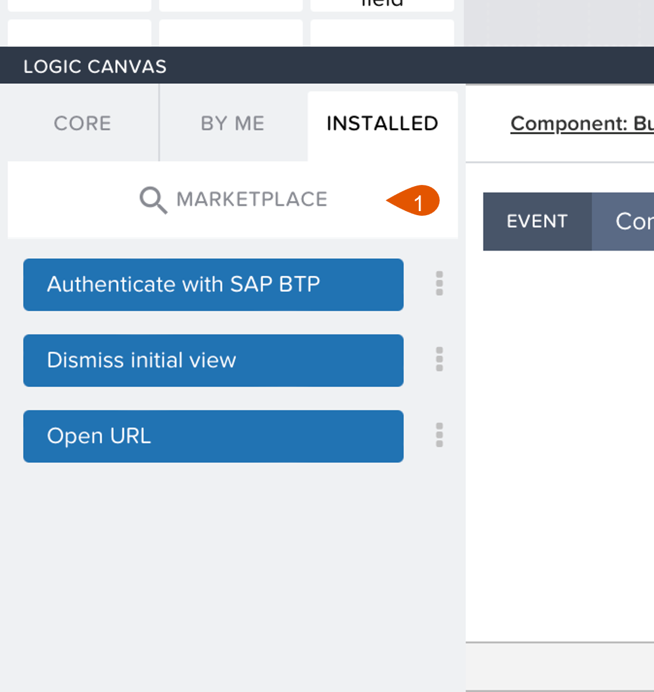

13. Search for **Open URL** and click on the first result.

    
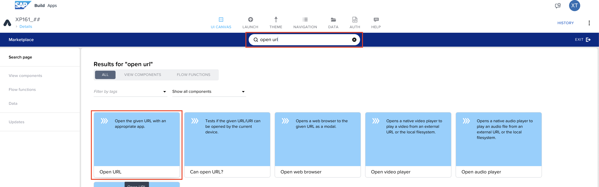

14. Use the button on the top right to **Install**.

15. Drag the **Open URL** box under the tab **Installed** now to the canvas.

16. Link the two **Components** by hovering over the endpoints and connecting them.

    
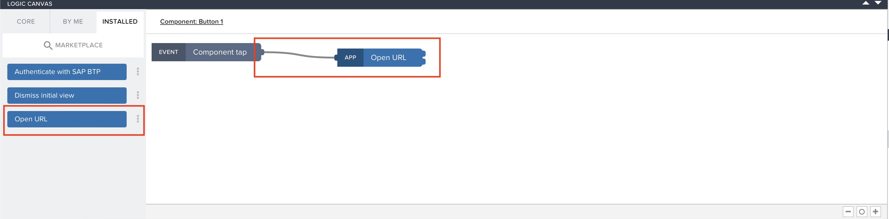

17. Click on the **Open URL** button and press the **ABC** button.

    
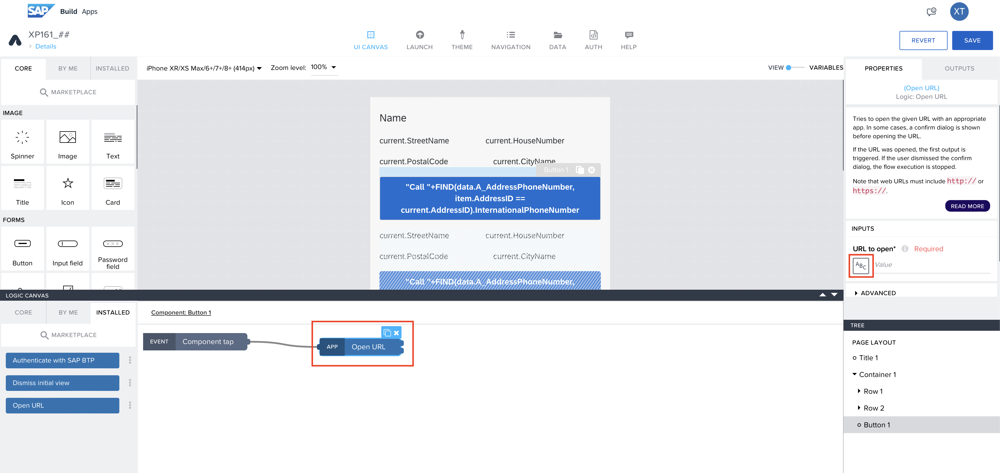

18. Click on **Formula**.

19. Enter `"tel:"+FIND(data.A_AddressPhoneNumber, item.AddressID == current.AddressID).InternationalPhoneNumber` as Formula expression.

    
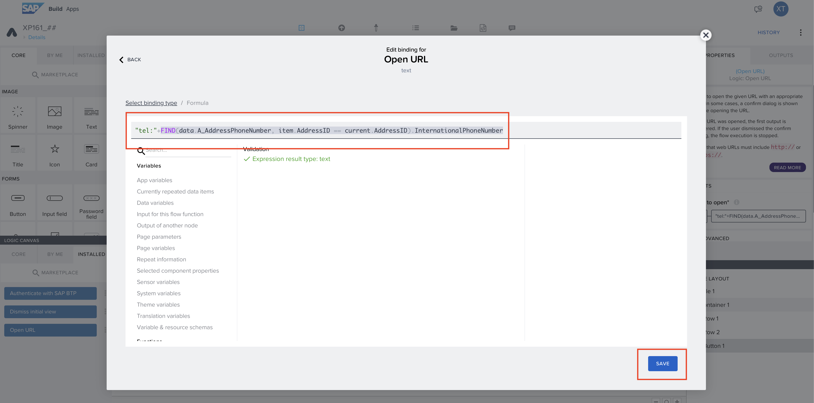

20. Press **Save**.

21. Congratulations, you have now added the **Call Function** to your app and you can test out in the **Web Preview**.

## Congrats

Awesome! You completed Exercise 2. 🥳

You can now navigate to the [Overview](../../#exercises).  
If your instructor already told you to continue with [Exercise 3](../ex3/), you navigate there using [this link](../ex3/).

## Further Remarks

### OData Expand

SAP Build Apps does offer to automatically expand relational fields from OData data sources. Alternatively to the approach this exercise is leveraging using a condition to filter for the correct entities, you could also leverage the expand functionality.
