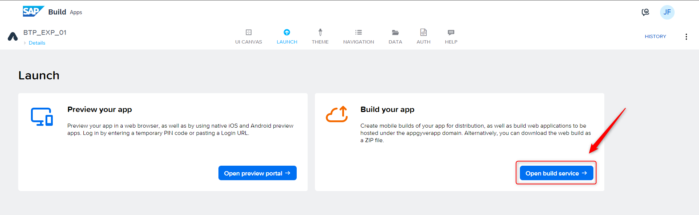
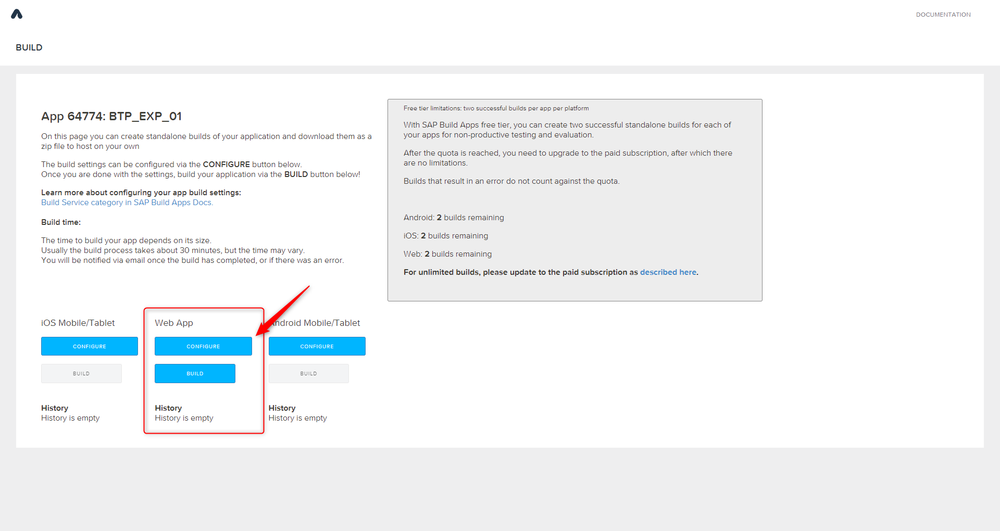
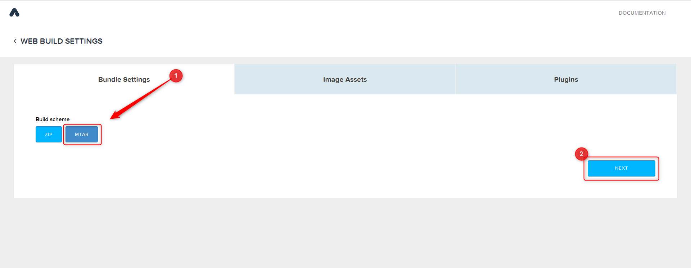
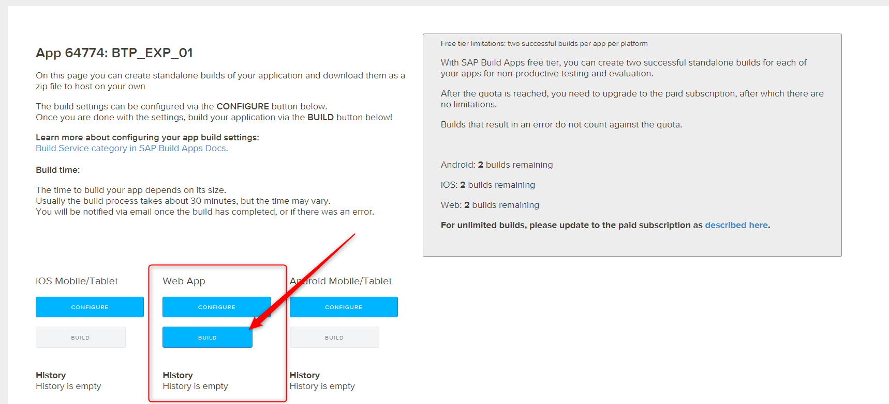
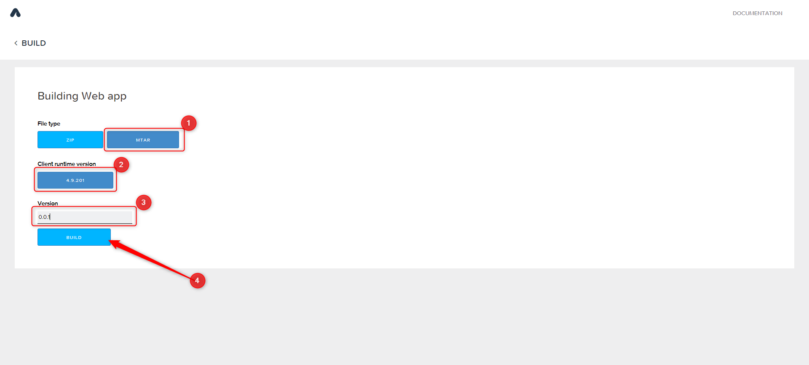
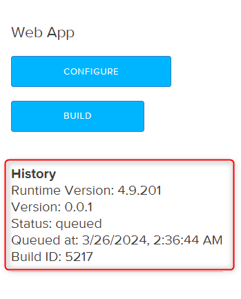

# Faça o Build da sua Aplicação

## Introdução

Nesta seção, você fara o build da aplicação que você criou usando o SAP Build Apps, e então implantá-la no SAP BTP como uma aplicação HTML5.

## Pré-requisitos

- Você deve ter completado os exercícios anteriores
- Seu SAP Build App está funcionando e pronto para ser implantado

## Passo 1: Build da aplicação

1. Clique na aba **LAUNCH**

2. Selecione **OPEN BUILD SERVICE**

    

3. Em **Web App**, clique em **CONFIGURE**

    

4. Em **Bundle Settings**, escolha **MTAR** e então clique em **NEXT**.

    

5. Em **Image Assets**, clique em **NEXT**

6. Em **Plugins**, clique em **NEXT**

7. Na seção **Web App**, clique em **BUILD**

    

8. Selecione o File Type como **MTAR**

9. Selecione a última client runtime version.

10. Escreva o número da versão, por exemplo, `0.0.1`

11. Clique no botão **BUILD**

    

    O build pode levar mais de 10 minutos. Normalmente a página se atualiza automaticamente. Mas você também pode atualizá-la manualmente de tempos em tempos para verificar o status.

12. Quando o build estiver completo, deverá aparecer no histórico de builds.

    

## Parabéns!

Você completou o build da aplicação que você desenvolveu no SAP Build Apps.

Incrível! Você completou o Exercício 3. 🥳

Você pode voltar para a página Overview [Overview](../../#exercises).  
Ou você pode seguir para o próximo exercício [Exercise 4](../ex4/), navegue para lá clicando no link [this link](../ex4/).
