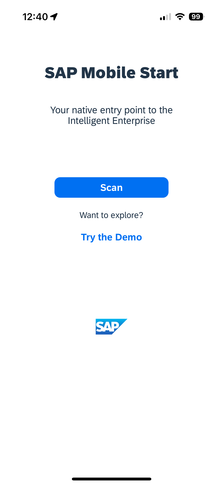
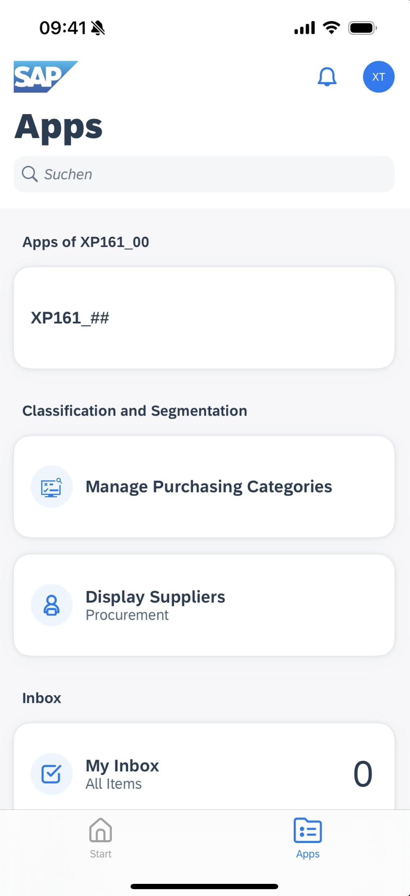

# Integrate your app with SAP Build Work Zone, standard edition and add it to SAP Mobile Start

## Introduction

In this section, the application will be connected with SAP Build Work Zone, standard edition. This allows to have one central entry point to show all of your SAP BTP applications.

## Prerequisites

- You have completed previous exercises
- Your SAP Build App is built successfully

## Step 1: Deploy your App

> **Please note:** If your app did not finish to build in time, you can skip this step and continue with **Step 2** using the pre-built application `XP161_Reference` (id `43206`). If you continue with the pre-built app instead of your own, remember its id for the following steps.

1. In **Web App** choose **DEPLOY_MTA**, select `cf-eu10-004` in the dropdown menu for **Endpoint** 

    You will need to authorize with your identity provider the first time you do this.

    In the popup enter `tdct3ched1-platform` as origin key and press **Sign in with alternative identity provider**

    

    >**Please Note:** If you are executing this outside of the TechEd 2023 hands-on workshop or on your own landscape, you may choose the applicable option for your SAP BTP subaccount.

2. Select the organization and space and then choose **DEPLOY_MTA**

    

3. Wait until the deployment is completed and choose **CLOSE**

    

## Step 2: Integrate your app with SAP Build Work Zone, standard edition

1. Open your [SAP Build Work Zone, standard edition](https://xp161-dt162-x75hy9xc.dt.launchpad.cfapps.eu10.hana.ondemand.com/)

2. In the menu on the left side choose the icon for **Channel Manager**.

3. Choose the refresh icon to fetch the updated content.

    

4. Choose **Content Manager** in the menu on the left and open **Content Explorer**.
    

5. Select the tile **HTML5 Apps** with your respective subdomain name.

    > **Please note:** You may see a lot of other Content Channels, simply ignore these. Only the **HTML5 Apps** one is relevant for this hands-on.

    

6. In the items table, search for your application by its name `XP161_##` (using your number) or the application id and set the checkmark. Choose the button **Add** afterwards.

    

7. Go back to the root page of the **Content Manager** by clicking the link above the headline **Content Explorer**. Click the **Create** button and  select **Group** from the dropdown.

    

8. Add the title `Apps of XP161_##` replacing `##` with your participant number.

9. Search for your application name `XP161_##` at the top left and tick the assignment status toggle.

    > **Please note:** You may see a lot of other content before searching. Just ignore it

10. Choose **Save**.

    

11. Back in the **Content Manager**, search for the role `XP161_##` (replacing `##` with your number) and click on the row with your role. Click the **Edit** button.

     

12. Search for your application name using `XP161_##` (using your number) at the top left and tick the assignment status toggle.

13. Click **Save**.

    

14. In the menu on the left side navigate to **Site Directory.**

15. Choose button **Create Site.**

    

16. Enter `XP161_##` (replacing `##` with your number) as name for the site and choose **Create.**

17. Now, you are forwarded to the site editor. Click **Edit**.

    Search for your role `XP161_##` (using your number) on the right column and click the **+** button.

    

18. Repeat this for the role `Purchaser` and select the one with the subtitle `S/4HANA`.

    

19. Click **Save**.

20. Go back to the Site Directory and find your created site. Open it by choosing the small **Go to site** icon.

    

21. You should be able to see your app in its defined section

    

## Step 2: Use your app in SAP Mobile Start

1. On your Site and select **Settings** from your **profile icon**

    

2. Go to **SAP Mobile Start** in the settings and select your **platform** and the **Register tab**

    

4. Open your SAP Mobile Start app, **agree** to the EULA and Privacy statements and **scan** the QR-Code

    

    

5. Enter your user credentials to login

    

6. Find and open your app in SAP Mobile Start

    

    

## Congrats

You Rock! You completed Exercise 4. 🥳

Congratulations! You now have finished the development of your application. In this last step you have integrated your app in SAP Build Work Zone, standard edition, to have one central entry point to show all of your SAP BTP applications. Finally, you have have opend your app in SAP Mobile Start.

You can now navigate to the [Overview](../../#exercises).  
